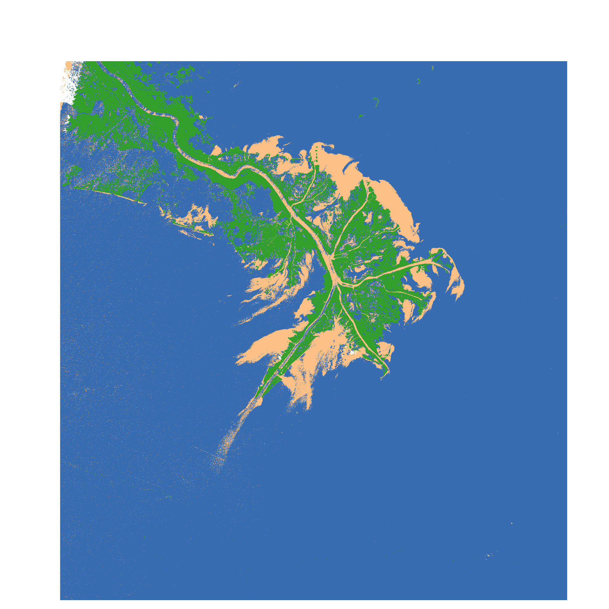
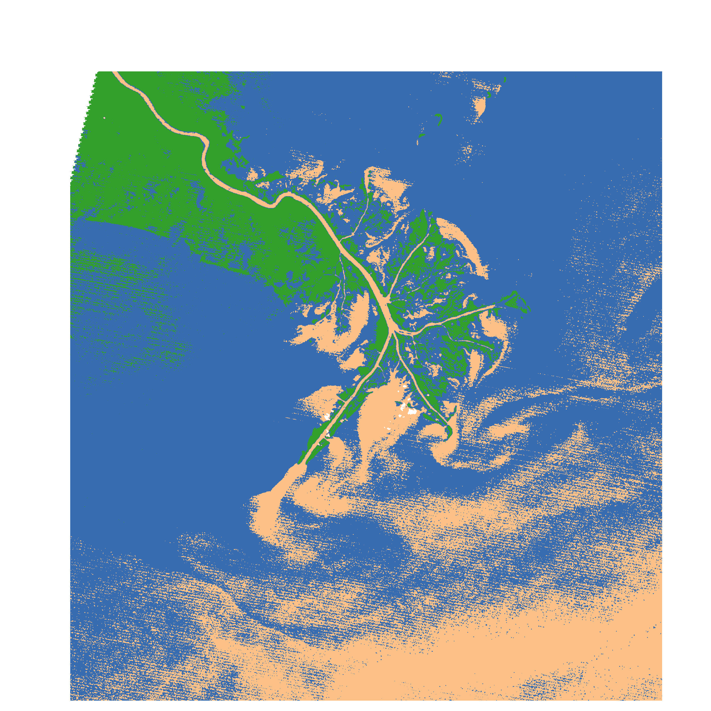
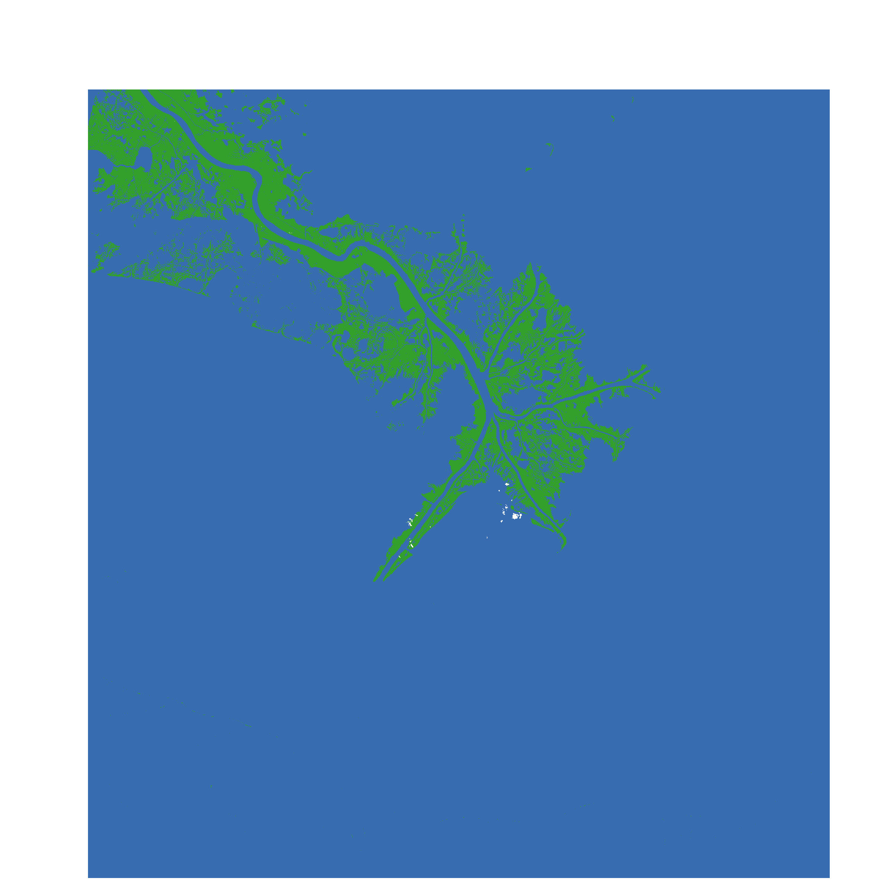
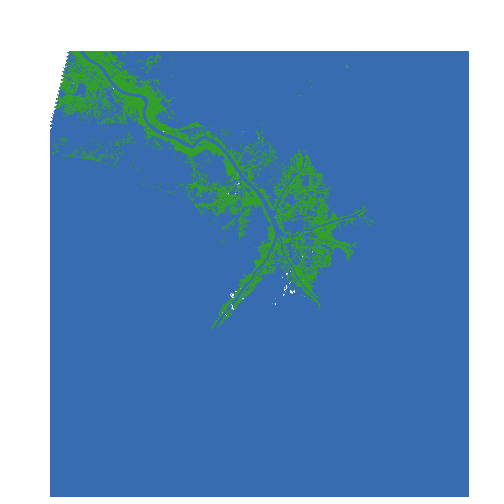

#### Comparing Supervised Learning Techniques Using Google Earth Engine

View the code on Google Earth Engine [1988 Image](https://code.earthengine.google.com/e2912fe36b763203b0d816efc065ff7e) [1995 Image](https://code.earthengine.google.com/72eb20b40a1bce050cb85ec35f3905ad) [2001 Image](https://code.earthengine.google.com/8826d0aa5696d9ce9e4af5f034b8a6db) [2014 Image](https://code.earthengine.google.com/b43e3073a07c2d83c6a78e9f56320c4f)

1988 CART

1988 Minimum Distance

1988 Naive Bayes

1988 Support Vector Machine

1988 Random Forest

2001 CART

2001 Minimum Distance

2001 Naive Bayes

2001 Support Vector Machine

2001 Random Forest

 
